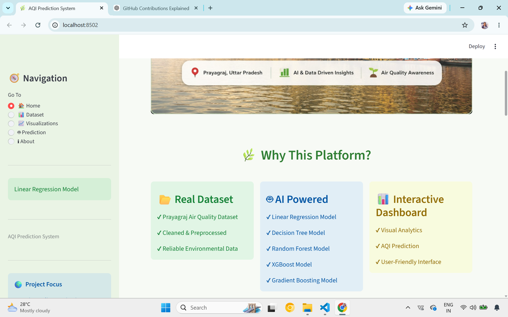
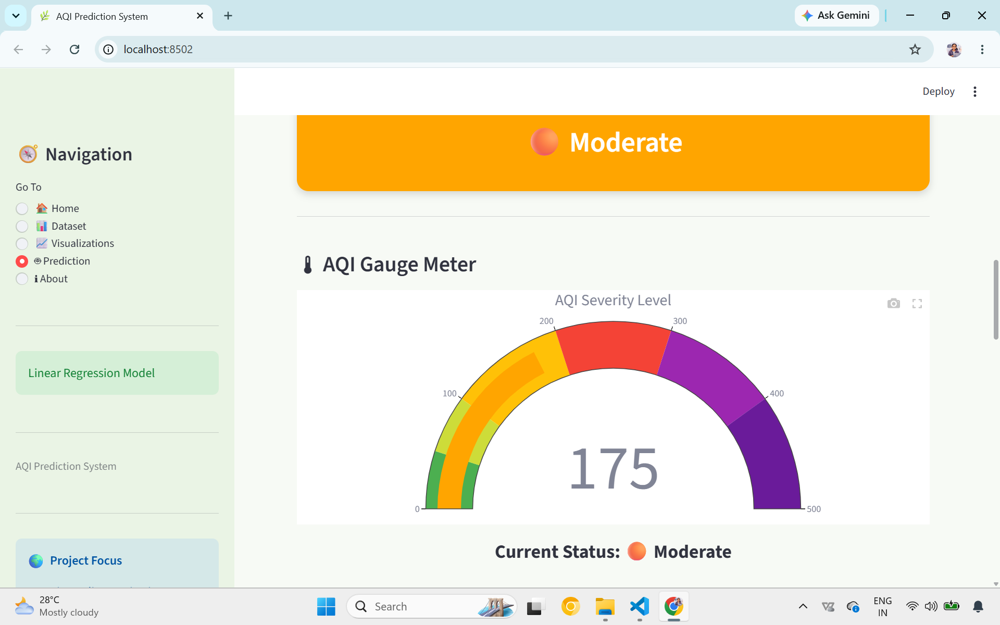
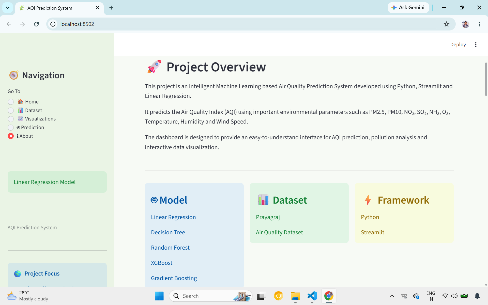
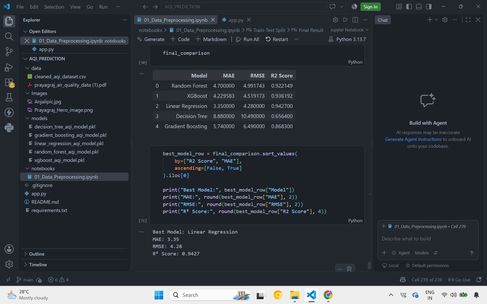

# ## 🚀 Live Demo

🔗 **[Open AQI Prediction Dashboard](YOUR_DEPLOYED_STREAMLIT_LINK)**


# 🌿 AQI Prediction System

### Machine Learning Based Air Quality Prediction & Intelligence Dashboard

An interactive **Air Quality Prediction System** developed using Machine Learning to analyze and predict the **Air Quality Index (AQI)** based on major environmental and meteorological parameters.

The project focuses on **Prayagraj air quality data** and provides an interactive Streamlit dashboard for data exploration, visualization, AQI prediction, health awareness, and Machine Learning model analysis.

---

# 🎯 Project Objective

The main objective of this project is to build an intelligent system that can:

- Predict AQI using environmental and meteorological parameters
- Analyze air quality patterns
- Visualize pollutant relationships and AQI trends
- Identify important factors influencing AQI
- Provide AQI-based health recommendations
- Compare multiple Machine Learning models
- Deliver predictions through an interactive dashboard

---

# 🖼️ Dashboard Preview

## 🏠 Home Page

The Home page provides an overview of the AQI Prediction platform, important AQI information, project statistics, and dataset insights.



---

## 🔮 Prediction Page

The Prediction page allows users to enter environmental parameters and generate an AQI prediction along with AQI status, gauge visualization, reliability information, contributors, and health advice.



---

## ℹ️ About Page

The About page provides information about the project, technology stack, workflow, features, and developer profile.



---

## 📊 Machine Learning Model Comparison

The project compares the performance of five Machine Learning regression models.



---

# 🖥️ Dashboard Structure

The Streamlit dashboard is organized into five main sections:

## 🏠 1. Home

Provides an overview of the platform, including:

- Why air quality monitoring matters
- Important AQI information
- Project statistics
- Dataset summary
- Air quality awareness

## 📊 2. Dataset

Displays the **Prayagraj Air Quality Dataset** and provides an overview of the data used for analysis and AQI prediction.

## 📈 3. Visualizations

Interactive visualizations are provided to understand air quality patterns, including:

- AQI Distribution
- Average AQI by Location
- Correlation Heatmap
- AQI vs Pollutants
- AQI Spread
- Average Pollutant Levels

## 🔮 4. Prediction

The prediction section provides an interactive AQI prediction system with:

- AQI Prediction
- Quick Demo Mode
- AQI Status Card
- AQI Gauge Meter
- Health Advisory
- Prediction Reliability
- Main Contributors
- Prediction Summary

Users can enter environmental parameters such as PM2.5, PM10, NO₂, SO₂, NH₃, O₃, Temperature, Humidity, and Wind Speed to generate an AQI prediction.

## ℹ️ 5. About

Contains information about:

- Project Overview
- Project Statistics
- Technology Stack
- Key Features
- Project Workflow
- Developer Profile

---

# 🤖 Machine Learning Models

Five regression algorithms were trained and evaluated for AQI prediction:

- Linear Regression
- Decision Tree Regressor
- Random Forest Regressor
- Gradient Boosting Regressor
- XGBoost Regressor

The models were evaluated and compared using:

- **MAE** — Mean Absolute Error
- **RMSE** — Root Mean Squared Error
- **R² Score** — Coefficient of Determination

## 🏆 Best Performing Model

Based on the final model comparison, **Linear Regression** achieved the best overall performance among the evaluated models.

| Metric | Score |
|---|---:|
| MAE | 3.35 |
| RMSE | 4.28 |
| R² Score | 0.9427 |

The trained Linear Regression model is used as the final prediction model in the dashboard.

---

# 🧪 Input Parameters

The prediction system uses the following 9 features:

| Parameter | Description |
|---|---|
| PM2.5 | Fine particulate matter |
| PM10 | Coarse particulate matter |
| NO₂ | Nitrogen dioxide |
| SO₂ | Sulfur dioxide |
| NH₃ | Ammonia |
| O₃ | Ozone |
| Temperature | Ambient temperature |
| Humidity | Relative humidity |
| Wind Speed | Wind velocity |

---

# ✨ Key Features

- 📍 Prayagraj-specific air quality analysis
- 🤖 Comparison of five Machine Learning models
- 🔮 Interactive AQI prediction
- 🧪 Quick demonstration scenarios
- 📊 Interactive data visualizations
- 🌡️ AQI Gauge Meter
- ❤️ AQI-based Health Advisory
- 🎯 Prediction Reliability analysis
- 📈 Main Contributors analysis
- 📋 Prediction Summary
- 🌿 Clean and user-friendly environmental dashboard
- 📱 Interactive Streamlit interface

---

# 🔄 Project Workflow

```text
Prayagraj AQI Dataset
        ↓
Data Preprocessing
        ↓
Exploratory Data Analysis
        ↓
Data Visualization
        ↓
Train Multiple ML Models
        ↓
Model Evaluation & Comparison
        ↓
Select Best Performing Model
        ↓
Save Trained Model
        ↓
Streamlit Dashboard
        ↓
User Input → AQI Prediction
        ↓
AQI Status + Gauge + Health Advisory
```

---

# 🛠️ Technology Stack

## Programming Language

- Python

## Libraries

- Pandas
- NumPy
- Scikit-learn
- XGBoost
- Plotly
- Matplotlib
- Seaborn

## Application Framework

- Streamlit

## Model Saving

- Joblib

## Development Tools

- Jupyter Notebook
- Visual Studio Code
- Git
- GitHub

---

# 📂 Project Structure

```text
AQI_PREDICTION/
│
├── data/
│   └── cleaned_aqi_dataset.csv
│
├── Images/
│   ├── about_dashboard.png.png
│   ├── Anjalipic.jpg
│   ├── home_dashboard.png.png
│   ├── model_comparison.png.png
│   ├── Prayagraj_Hero_image.png
│   └── prediction_dashboard.png.png
│
├── models/
│   ├── decision_tree_aqi_model.pkl
│   ├── gradient_boosting_aqi_model.pkl
│   ├── linear_regression_aqi_model.pkl
│   ├── random_forest_aqi_model.pkl
│   └── xgboost_aqi_model.pkl
│
├── notebooks/
│   └── 01_Data_Preprocessing.ipynb
│
├── .gitignore
├── app.py
├── README.md
└── requirements.txt
```

---

# 🚀 How to Run the Project

## 1. Clone the Repository

```bash
git clone <repository-url>
cd AQI_PREDICTION
```

## 2. Install Dependencies

```bash
pip install -r requirements.txt
```

## 3. Run the Streamlit Application

```bash
streamlit run app.py
```

The application will open in your web browser.

---

# 🎓 Project Context

This project was developed as a practical implementation of **Data Science and Machine Learning concepts**, covering data preprocessing, exploratory data analysis, visualization, model development, evaluation, and deployment.

The project work also reflects practical learning gained through internship experience.

---

# 👩‍💻 Developer

## Anjali Tiwari

**B.Tech — Computer Science and Engineering (Data Science)**

### Areas of Interest

- Data Science
- Machine Learning
- Artificial Intelligence
- Data Visualization
- Python Development

This project represents a practical implementation of Machine Learning concepts in an interactive real-world application.

---

# 🌱 Future Enhancements

- Real-time AQI data integration
- Weather API integration
- Time-series AQI forecasting
- Cloud deployment
- Automated model retraining
- Location-based AQI monitoring
- Advanced Explainable AI techniques

---

# 📌 Project Status

**✅ Completed — Interactive AQI Prediction Dashboard**

Built using **Python, Machine Learning, Plotly, and Streamlit**.